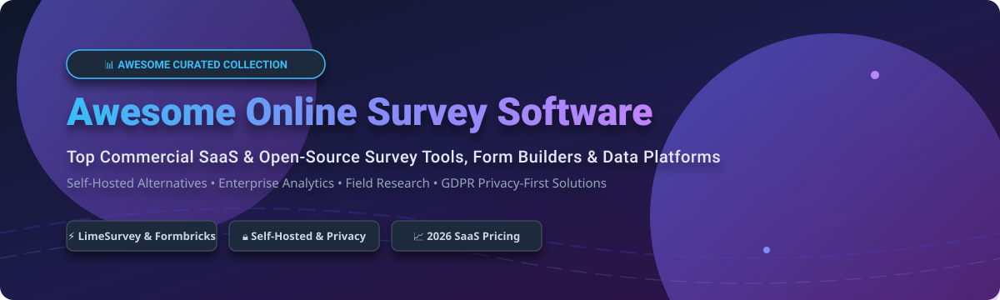

  

  
  
  
  
  
  

# 📊 Awesome Online Survey Software & Form Builders

> **A curated, SEO-optimized list of top commercial SaaS products and open-source GitHub projects for creating online surveys, building custom forms, self-hosting survey platforms, and conducting data collection & field research.**

**Last updated: October 2026**

---

## 📌 Executive Overview & Market Analysis

This repository tracks notable **commercial survey platforms**, **open-source form engines**, and **field data collection tools**. Whether you are looking for simple no-code form builders or enterprise-grade research platforms with complex piping, skip logic, and real-time analytics, this list covers the entire online survey software landscape.

### 📈 Market Size & Sector Structure

**Market Size**: The global online survey software market is valued at approximately **$4.58 Billion – $5.42 Billion in 2025/2026**, projected to grow at a Compound Annual Growth Rate (CAGR) of **14% to 17%**.

**Sector Structure**: The market is **moderately to highly fragmented**. Rather than a single "winner-take-all" monopoly, the market is split across multi-trillion-dollar office suite platforms (*Microsoft Forms, Google Forms*), enterprise research suites (*Qualtrics, SurveyMonkey*), user experience tools (*Typeform, Formbricks*), and self-hosted open-source software (*LimeSurvey, OpnForm, NocoDB*).

---

## 📑 Table of Contents

- [🏢 Top SaaS & Commercial Survey Platforms](#-top-saas--commercial-survey-platforms)
- [⚡ Open-Source GitHub Projects (Sorted by Stars)](#-open-source-github-projects-sorted-by-stars)
- [🛠️ Key Evaluation Criteria for Survey Tools](#%EF%B8%8F-key-evaluation-criteria-for-survey-tools)
- [🤝 How to Contribute](#-how-to-contribute)
- [💖 Support & Sponsorship](#-support--sponsorship)
- [🌟 Star History](#-star-history)
- [⚠️ Disclaimer](#%EF%B8%8F-disclaimer)

---

## 🏢 Top SaaS & Commercial Survey Platforms

Below is a comparative matrix of commercial survey software platforms, sorted by **Company Size / Valuation (Descending)** with exact starting tier prices and free tier limits.

| Platform | 🏢 Company Size (Valuation / Revenue) | 💵 Starting Price (Paid Tier) | 🎁 Free Tier / Free Trial Limits | 🔍 Description & Best For |
| :--- | :--- | :--- | :--- | :--- |
| **[Microsoft Forms](https://forms.microsoft.com/)** | **~$3.2 Trillion** Market Cap (~$245B ARR) | **$7.00 / user / mo** (Included in Microsoft 365 Business Basic) | **Free with Microsoft Account**: Max 200 responses/form, 400 total forms, 200 questions/form | **Free survey tool for Microsoft 365 users** — simple surveys, quizzes, and polls with Excel integration. **Best for Microsoft ecosystem users**. |
| **[Google Forms](https://forms.google.com/)** | **~$2.1 Trillion** Market Cap (~$307B ARR) | **$0.00 / mo** (100% free standalone; Google Workspace starts at $7.20/user/mo) | **Free Forever**: Unlimited forms and responses (capped only by 15 GB Google Drive storage pool) | **Free, simple survey tool** — unlimited surveys, Google Sheets integration, and real-time collaboration. **The most accessible survey tool**. |
| **[Qualtrics](https://www.qualtrics.com/)** | **$12.5 Billion** Valuation (~$1.5B ARR) | **$420.00 / mo** ($5,040/yr billed annually for Strategic Research; Enterprise $25k+/yr) | **30-Day Free Trial**; permanent Free Account limited to 3 active surveys, 30 questions/survey, and 500 total responses | **The enterprise research standard** — advanced logic, piping, quotas, and analytics. **Best for academic and enterprise research**. |
| **[SurveyMonkey](https://www.surveymonkey.com/)** | **$1.5 Billion** Valuation (~$480M ARR) | **$39.00 / mo** ($468/yr Advantage annual plan; Team plans $30/user/mo) | **Free Basic Plan**: Max 10 questions per survey and 40 viewable responses per survey (no CSV exports) | **The most widely used survey platform** — extensive question types, logic, and analytics. **The reference for survey software**. |
| **[Typeform](https://www.typeform.com/)** | **~$1.0 Billion** Valuation (~$140M–$200M ARR) | **$25.00 / mo** ($300/yr Basic annual plan) | **Free Account**: Capped at 10 responses per month across all forms and 1 user seat | **The best-designed survey experience** — conversational forms, beautiful templates, and high completion rates. **Best for engaging, brand-aligned surveys**. |
| **[Jotform](https://www.jotform.com/)** | **~$145 Million** ARR (Bootstrapped, ~$700M–$1B Est. Valuation) | **$34.00 / mo** ($408/yr Bronze annual plan) | **Starter Free Plan**: Max 5 active forms, 100 monthly submissions, 500 total submission storage, 100 MB file space | **Form builder with 10,000+ templates** — payments, conditional logic, and integrations. **Best for diverse form needs**. |
| **[QuestionPro](https://www.questionpro.com/)** | **~$56.4 Million** ARR (Bootstrapped, Private) | **$99.00 / mo** ($1,188/yr Advanced annual plan) | **Essentials Free Plan**: Max 200 responses per survey, 30 questions per survey, basic branching logic | **Survey platform with research-grade features** — advanced analytics, polling, and offline surveys. **Best for academic research**. |
| **[Formstack](https://www.formstack.com/)** | **~$35.6 Million** ARR (Private, PE-backed) | **$50.00 / mo** ($600/yr Forms annual plan) | **14-Day Free Trial**: Full feature access during trial; no permanent free tier available | **Form builder with workflow automation** — document generation, payments, and integrations. **Best for business process automation**. |
| **[Alchemer](https://www.alchemer.com/)** | **~$30.0 Million** ARR (PE-backed by K1) | **$55.00 / mo** ($660/yr Collaborator annual plan) | **7-Day Free Trial**: Full feature access during trial; no permanent free tier available | **Enterprise survey platform** — advanced logic, reporting, and integrations. **Best for complex enterprise surveys**. |
| **[SurveyLegend](https://www.surveylegend.com/)** | **~$137.6 Thousand** ARR (Bootstrapped, Private) | **$19.00 / mo** ($228/yr Pro annual plan) | **Starter Free Plan**: 3 active surveys, max 3 response fields per survey, no export options, includes SurveyLegend ads | **Visual survey builder** — image-based questions and mobile-first design. **Best for visual surveys**. |

---

## ⚡ Open-Source GitHub Projects (Sorted by Stars)

Open-source online survey tools offer complete data sovereignty, GDPR compliance, custom self-hosting capabilities, and zero per-response fees.

All open-source repositories below are **sorted in descending order by GitHub Star Count**.

1. 🌟 **[NocoDB](https://github.com/nocodb/nocodb)**   
   **Open-source Airtable alternative with form view capabilities** — AGPL-3.0 licensed. Build custom database tables, share public form views, collect survey responses, and automate workflows. **Best for relational survey databases**.

2. 🌟 **[Appsmith](https://github.com/appsmithorg/appsmith)**   
   **Open-source low-code internal tool & form platform** — Apache-2.0 licensed. Drag-and-drop form widgets, connect to any database or API, build multi-step survey tools and admin portals. **Best for custom internal survey tools**.

3. 🌟 **[Formbricks](https://github.com/formbricks/formbricks)**   
   **Modern open-source experience management & survey platform** — AGPL-3.0 licensed. Features in-app surveys, link surveys, website targeted popups, conditional logic, and GDPR privacy compliance. **The premier modern open-source Typeform/Qualtrics alternative**.

4. 🌟 **[Form.io](https://github.com/formio/formio)**   
   **Open-source JSON form builder and data management platform** — MIT licensed. API-first architecture designed to embed complex forms directly into web and mobile apps. **Best for software developers**.

5. 🌟 **[HeyForm](https://github.com/heyform/heyform)**   
   **Open-source conversational form builder** — AGPL-3.0 licensed. Create engaging, visual, step-by-step surveys inspired by Typeform with logic jumps, payment integrations, and rich media support. **Best for visual interactive forms**.

6. 🌟 **[Baserow](https://github.com/baserow/baserow)**   
   **Open-source database with public form views** — MIT licensed. Modular open-source database system allowing teams to build public-facing surveys and automatically populate structured database tables. **Best for structured data collection**.

7. 🌟 **[SurveyJS](https://github.com/surveyjs/survey-library)**   
   **Open-source JavaScript survey library & builder framework** — MIT licensed. Integrate 30+ question types, branching logic, and custom components directly into React, Angular, Vue, or vanilla JS applications. **The standard JavaScript survey library**.

8. 🌟 **[LimeSurvey](https://github.com/LimeSurvey/LimeSurvey)**   
   **The leading open-source survey platform** — GPL-2.0 licensed. 25+ years of active development. Features 28+ question types, advanced conditional logic, quotas, token management, assessments, and 80+ language translations. **The de facto open-source SurveyMonkey alternative**.

9. 🌟 **[OpnForm](https://github.com/OpnForm/OpnForm)**   
   **Open-source form builder built with Laravel & Vue** — AGPL-3.0 licensed. Clean modern UI, AI form generation, webhooks, slack notifications, and custom domain support. **Best for modern self-hosted forms**.

10. 🌟 **[TellForm](https://github.com/tellform/tellform)**   
    **Open-source form builder** — MIT licensed. Node.js based form builder with drag-and-drop support, customizable analytics, and custom form branding. **Best for lightweight Node.js form hosting**.

11. 🌟 **[OhMyForm](https://github.com/ohmyform/ohmyform)**   
    **Free, open-source form builder** — AGPL-3.0 licensed. Self-hosted form management application designed to create forms, manage responses, and export collected data securely. **Best for privacy-conscious teams**.

12. 🌟 **[Enketo Express](https://github.com/enketo/enketo-express)**   
    **Open-source web forms for ODK & XLSForm** — Apache-2.0 licensed. Enables offline-capable web survey collection, rendering complex XLSForm specifications smoothly across desktop and mobile web browsers. **Best for web-based field research**.

13. 🌟 **[ODK Collect](https://github.com/getodk/collect)**   
    **Open-source mobile field data collection app** — Apache-2.0 licensed. Standard mobile app for collecting survey responses, GPS coordinates, photos, signatures, and barcodes offline in low-resource environments. **The global standard for field data collection**.

14. 🌟 **[formsflow.ai](https://github.com/AOT-Technologies/forms-flow-ai)**   
    **Open-source combined form, workflow & analytics suite** — MIT licensed. Integrates Form.io form building with Camunda workflow orchestration and Redash analytics dashboarding. **Best for enterprise workflow surveys**.

15. 🌟 **[Tutim](https://github.com/tutim-io/tutim)**   
    **Open-source form builder for developers** — AGPL-3.0 licensed. Headless form infrastructure for building dynamic user onboarding flows, questionnaires, and survey steps in web apps. **Best for web onboarding forms**.

16. 🌟 **[KoboToolbox (KPI)](https://github.com/kobotoolbox/kpi)**   
    **Open-source field data collection platform** — GPL-3.0 licensed. Designed for humanitarian organizations, research teams, and NGOs operating in challenging offline environments. **Best for humanitarian research**.

17. 🌟 **[XLSForm Offline](https://github.com/XLSForm/xlsform-offline)**   
    **Open-source XLSForm converter utility** — MIT licensed. Convert Excel-based survey definitions into standard XML formats for ODK, Enketo, and KoboToolbox offline collection engines. **Best for Excel-designed field surveys**.

---

## 🛠️ Key Evaluation Criteria for Survey Tools

When choosing between commercial SaaS platforms and self-hosted open-source software, consider the following technical parameters:

- **🔒 Data Sovereignty & GDPR Compliance**: Enterprise and healthcare organizations often require full control over survey data (self-hosted options like **LimeSurvey** or **Formbricks**).
- **🔀 Logic Jumps & Piping**: Complex surveys require branching logic, dynamic variable piping, quota controls, and answer randomized matrices (**Qualtrics**, **LimeSurvey**, **SurveyMonkey**).
- **📴 Offline Collection Capability**: Field teams in remote regions need offline mobile storage, photo captures, and GPS tags (**ODK Collect**, **Enketo**, **KoboToolbox**).
- **🎨 User Experience & Conversational Flow**: High consumer engagement requires modern step-by-step interactive forms (**Typeform**, **HeyForm**, **OpnForm**).

---

## 🤝 How to Contribute

Contributions are warmly welcomed! Help us keep this list up to date with the latest survey tools and open-source form engines.

1. 🍴 **Fork the repository**
2. 📝 **Add or update an entry** in `README.md` (maintain exact markdown table or star badge layout)
3. 🔎 **Provide accurate details**: Name, homepage/repo link, description, pricing, and free tier limits
4. 📬 **Submit a Pull Request** with a brief summary of additions

Check out [Awesome-Awesome-Awesome](https://github.com/ishandutta2007/Awesome-Awesome-Awesome) for more curated lists!

---

## 💖 Support & Sponsorship

If you find this survey software directory helpful, please consider supporting the project! Your encouragement helps keep this resource updated, accurate, and comprehensive for researchers, developers, and product teams worldwide.

- ⭐️ **Star this repository** on GitHub to increase visibility
- 🔀 **Fork & Share** with your colleagues and research network
- ☕ **Buy me a coffee / Sponsor**: Support ongoing maintenance on the [GitHub Sponsor Dashboard](https://github.com/sponsors/ishandutta2007)

  

---

## 🌟 Star History

---

## ⚠️ Disclaimer

- This repository is a **community-curated informational directory** and does not constitute formal financial, legal, or enterprise purchasing endorsement.
- Product pricing, features, and limits are subject to change by vendors over time. Always consult official vendor websites for final pricing details.
- Survey software handles sensitive personal data (PII). Ensure proper security configuration, data encryption, and legal compliance (GDPR, CCPA, HIPAA) when deploying self-hosted or SaaS survey platforms.
